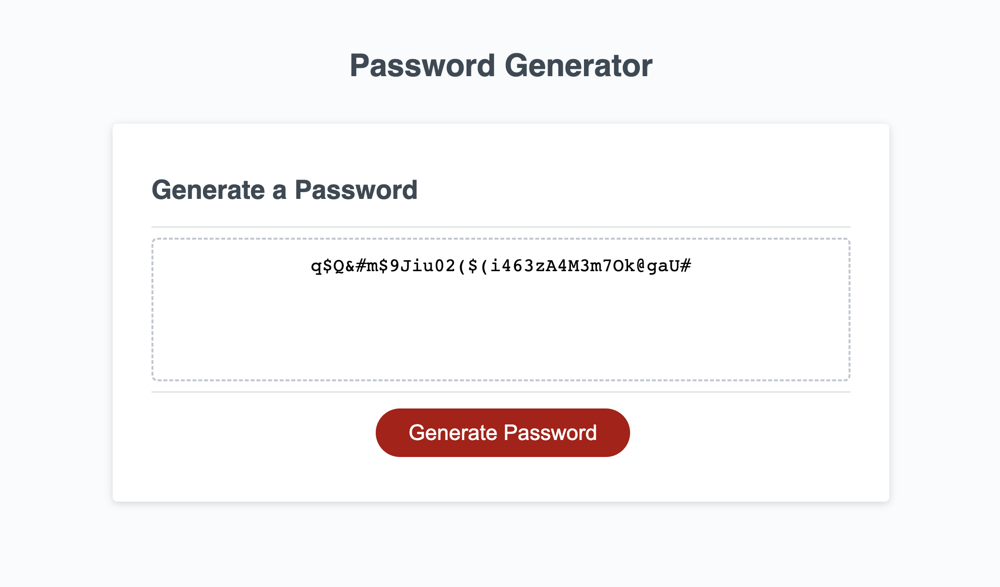

# <Random-Password-Generator>

## Description

This project is a simple password generator that generates random strings of characters based on user selections:

- This project was created to enable users to quickly and easily generate strings of characters that can be used as secure passwords.
- Generated passwords are customizable and take into account the following user selections: password length (between 8-128 char), contains lowercase letters (yes/no), contains caps (yes/no), contains numbers (yes/no), contains special characters (yes/no).
- This web app allows users to up their password security by utilizing custom, random password generation. This makes it harder for malicious parties to guess your password and keeps you safe.
- Throughout this project, I improved my understanding of basic JS concepts through the creation of the random generation code. After wrapping up this project, I feel more confident adding additional features and UI or tackling more advanced projects.

## Usage

### [Generate your password here: Online Password Generator](https://abealberts.github.io/random-password-generator/)

Screenshot:

  

## Features

- Random Password Generation
- Customizable Password Criteria
- Password Criteria Validation (Code checks that generated password meets user criteria before outputting)

## Credits

List your collaborators, if any, with links to their GitHub profiles.

If you used any third-party assets that require attribution, list the creators with links to their primary web presence in this section.

### Threads/tutorials used during development:

[- Finding parts of an array in another array](https://stackoverflow.com/questions/16312528/check-if-an-array-contains-any-element-of-another-array-in-javascript)

## License

MIT License

Copyright (c) [2023] [Abe Alberts]

Permission is hereby granted, free of charge, to any person obtaining a copy
of this software and associated documentation files (the "Software"), to deal
in the Software without restriction, including without limitation the rights
to use, copy, modify, merge, publish, distribute, sublicense, and/or sell
copies of the Software, and to permit persons to whom the Software is
furnished to do so, subject to the following conditions:

The above copyright notice and this permission notice shall be included in all
copies or substantial portions of the Software.

THE SOFTWARE IS PROVIDED "AS IS", WITHOUT WARRANTY OF ANY KIND, EXPRESS OR
IMPLIED, INCLUDING BUT NOT LIMITED TO THE WARRANTIES OF MERCHANTABILITY,
FITNESS FOR A PARTICULAR PURPOSE AND NONINFRINGEMENT. IN NO EVENT SHALL THE
AUTHORS OR COPYRIGHT HOLDERS BE LIABLE FOR ANY CLAIM, DAMAGES OR OTHER
LIABILITY, WHETHER IN AN ACTION OF CONTRACT, TORT OR OTHERWISE, ARISING FROM,
OUT OF OR IN CONNECTION WITH THE SOFTWARE OR THE USE OR OTHER DEALINGS IN THE
SOFTWARE.